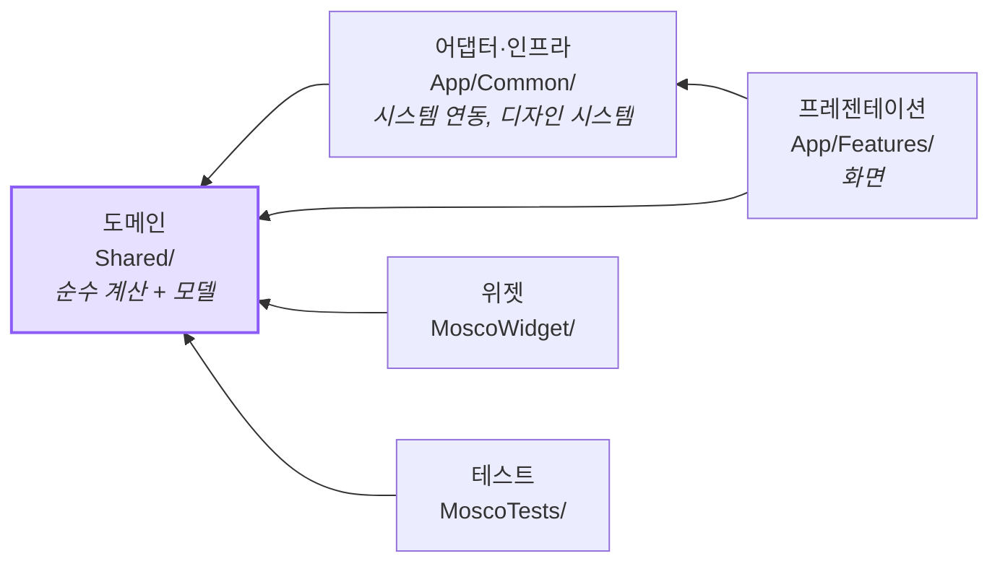

# 코드 배치 규범

**새 코드를 어디에 두고, 무엇을 하지 않는가.**

`DesignSystem/README.md`가 색과 문구에 하는 일을 코드 구조에 하는 문서다. 이름 붙은
아키텍처(MVVM·TCA 같은 것)는 지금 채택하지 않았다 — 그 판단의 근거는
[`DECISIONS.md`](DECISIONS.md) D2에 있다.

**미정인 항목은 "미정"이라고 적어뒀다.** 빈칸이 보여야 채워진다. 리팩터링 1~2단계를
지나면서 하나씩 확정한다.

---

## 0. 레이어와 의존 방향

폴더에 이름을 붙였다. 새 구조를 도입한 게 아니라 **이미 그렇게 돌고 있던 것에 이름을
준 것**이다.



**화살표는 안쪽으로만 간다.** 도메인은 바깥을 모른다.

이름을 붙이는 값은 셋이다. "새 코드 어디 두지"에 즉답할 수 있고, 폴더만 보고 성격을
짐작할 수 있고, **기계가 방향을 검사할 수 있다.**

```bash
python3 tools/quality_baseline.py   # "레이어 의존 방향" 절
```

`Shared/ → App/` 방향은 검사할 필요가 없다. **위젯과 테스트 빌드가 이미 막는다** —
그 두 타깃은 `App/`을 컴파일하지 않으므로 컴파일러가 잡는다. 같은 타깃 안이라
컴파일러가 못 잡는 둘만 스크립트가 본다.

### 지금 어긋나 있는 넷 (2026-08-22)

이름을 붙이자마자 드러난 것들이다. **당장 고치지 않고 기록해둔다** — 리팩터링
2·3단계에서 함께 처리한다.

| 위반 | 어디 | 어떻게 풀 것인가 |
|---|---|---|
| Settings → Calendar | `CategoryListScreen`이 `Calendar/`의 `CategoryEditorSheet`를 쓴다 | **시트를 `Settings/`로 옮긴다.** 쓰는 쪽이 Settings다 |
| Calendar → Settings | `CalendarScreen`이 `SettingsScreen()`을 시트로 띄운다 | 위와 합쳐 **순환**이 된다. 시트를 옮기면 이쪽만 남는데, **화면 이동은 예외로 둔다** (6절) |
| TodayTodo → Calendar | `TodayTodoScreen`이 `Calendar/`의 `DayTimelineView`를 쓴다 | 둘 다 쓰는 것은 위로 올린다 (6절) |
| 어댑터 → 화면 | `EmbeddingCategoryClassifier`가 `Features/`의 `CategoryClassifying` 프로토콜을 구현 | **프로토콜을 `Shared/`로 내린다.** 구현은 `Common/`에 남는다 |

## 1. 로직을 어디 두나

가장 중요한 규칙 하나다.

> **순수하면 `Shared/`에 둔다. 뷰 안에 두지 않는다.**

이건 취향이 아니라 물리적 제약이다. **테스트 타깃은 `Shared/`만 컴파일한다**(호스트
앱이 없다). `App/` 아래 있는 것은 무슨 수를 써도 테스트할 수 없다.

| 성격 | 어디 | 예 |
|---|---|---|
| 순수 계산 (같은 입력 → 같은 출력) | `Shared/` | `TimelineLayout`, `PermissionGate`, `TimeExpressionParser` |
| 부작용이 있는 조율 | `App/Common/<모듈>/` | `WeatherStore`, `TodoNotificationScheduler` |
| 그리기 | `App/Features/<화면>/` | 뷰 struct |
| 앱·위젯이 같이 쓰는 것 | `Shared/` **필수** | 위젯은 `App/`을 못 본다 |

**뷰 안에 두려면 이유를 적는다.** "그리는 데만 쓰는 3줄짜리 계산"은 괜찮다.
날짜 계산·정렬 규칙·파싱·정책 판단은 안 된다.

### `Shared/`에 둘 때 지킬 것

- `nonisolated`를 명시한다. 이 프로젝트는 기본이 `@MainActor`라(`SWIFT_DEFAULT_ACTOR_ISOLATION`)
  안 붙이면 백그라운드에서 못 쓴다
- SwiftData 모델(`TodoItem` 등)을 직접 받지 말고 **값 타입을 받는다**.
  `TodoSnapshot`이 그 목적으로 이미 있다. 모델을 받으면 테스트에서 컨테이너가 필요해진다
- `import SwiftUI`를 새로 늘리지 않는다. 지금 넷이 있는데(`ThemeColor` 등 색 반환
  때문) 그 이상은 안 된다

---

## 2. 뷰가 하지 않는 것

| 하지 않는다 | 대신 |
|---|---|
| 날짜·시각 계산 | `Shared/`의 순수 함수 |
| 정렬·필터 **규칙 정의** | `Shared/`. 부르는 건 뷰가 해도 된다 |
| 문자열 파싱, 라벨 조립 정책 | `Shared/` |
| `modelContext.insert/delete/save` 직접 | 가능하면 액션 함수로 모은다. **미정** — 아래 5번 |
| 싱글턴 직접 참조 (`Xxx.shared`) | `@Environment`. 이미 `RootTabView`가 일곱 개를 주입한다 |
| 폰트·여백·반경 숫자 | `Metrics`·`Font.moscoXxx()` 토큰. 없으면 토큰에 추가하고 **말한다** |

**싱글턴 예외는 둘뿐이다.** `SharedModelContainer`와 `TodoLiveActivityController`.
위젯 타임라인과 `LiveActivityIntent`는 **시스템이 우리 코드를 밖에서 부르는 진입점**이라
주입할 통로가 없다. 그 밖의 `Xxx.shared` 직접 참조는 새로 만들지 않는다.

---

## 3. 상태를 어디 두나

| 범위 | 어디 |
|---|---|
| 그 뷰만 쓴다 | `@State` |
| 부모와 자식이 같이 쓴다 | 부모가 `@State`, 자식은 `@Binding` 또는 값으로 받는다 |
| 화면 여럿이 쓴다 | `@Environment` (`RootTabView`가 주입) |
| 껐다 켜도 남아야 한다 | `@AppStorage` + `Shared/`의 키 상수 |

**파생 상태를 `@State`로 두지 않는다.** 다른 상태에서 계산되는 값은 계산 프로퍼티이거나
순수 함수의 결과다. `@State`로 두면 두 값이 어긋나는 순간이 생긴다.

---

## 4. 시스템 API를 붙일 때

**새로 붙이는 것은 프로토콜 뒤에 둔다.** 본보기가 이미 있다 — `Analytics`는
`AnalyticsSink` 프로토콜이 있어서 테스트에서 갈아끼울 수 있고, `AnalyticsIdentity`는
`IdentityStore`로 저장소를 주입받는다.

지금 프로토콜이 없는 넷(날씨·알림·동기화·저장소)은 **기존 코드라 당장 고치지 않는다.**
다만 그 파일을 크게 손볼 일이 생기면 그때 프로토콜을 만든다.

---

## 5. 아직 안 정한 것

여기 있는 것들은 **리팩터링을 하면서 정한다.** 지금 정하면 근거 없이 정하게 된다.

| 미정 | 왜 아직 못 정하나 | 언제 정하나 |
|---|---|---|
| **데이터 접근을 어느 갈래로 통일할지** | 지금 두 방식이 공존한다 — 달력은 `TodoQueryBridge`로 리프에 격리, 나머지 셋은 뷰 본체에서 `@Query`. 앞의 것은 성능 문제를 겪고 만든 구조인데 그 결정이 문서에 없어서 다음 화면들이 옛 방식으로 갔다 | 2단계에서 "이 계산이 `@Query` 결과를 정말 필요로 하나"가 드러난 뒤 |
| 화면 상태를 struct 하나로 모을지 | 추출 뒤 뷰에 무엇이 남는지 봐야 안다 | 2단계 뒤 |
| 뷰에서 저장소 쓰기를 어떻게 할지 | 위와 같이 본다 | 2단계 뒤 |
| 새 화면 하나에 파일 몇 개 | 지금은 화면당 한 파일인데 셋이 500줄을 넘었다. 쪼개는 기준이 줄 수인지 책임 수인지 정해야 한다 | 3단계 |
| 이름 붙은 아키텍처를 쓸지 | [`DECISIONS.md`](DECISIONS.md) D2. **사람이 늘면 저울이 기운다** | 2단계 뒤 |

---

## 6. 파일을 어디 두나

- **한 Feature 폴더에 다른 Feature가 쓰는 것을 두지 않는다.** 지금 어긋난 곳이
  셋이고 0절에 표로 있다
- **화면 이동은 예외다.** 화면 A가 화면 B를 시트로 띄우거나 밀어 넣는 것은 의존이
  아니라 흐름이다. 지금은 라우팅 층이 없으니 부르는 쪽이 직접 띄운다. 화면이 두 배가
  되면 다시 본다 (`PATTERNS.md` B4)
- 둘 이상의 Feature가 쓰면 `App/Common/`으로 올린다
- 앱과 위젯이 같이 쓰면 `Shared/`로 내린다 (선택이 아니라 필수)

---

## 7. 이 문서를 언제 고치나

- 미정 항목을 하나 정했을 때 — **정한 이유를 같이 적는다**
- 규범을 어긴 코드를 넣기로 했을 때 — 예외와 그 근거를 적는다
- 같은 질문이 두 번 나왔을 때 — 그건 여기 답이 없다는 뜻이다

`DesignSystem/README.md`와 같은 원칙으로 쓴다. **되돌린 시도를 남긴다** — 한 번
해보고 아니었던 것을 다시 제안하지 않기 위해서다.
