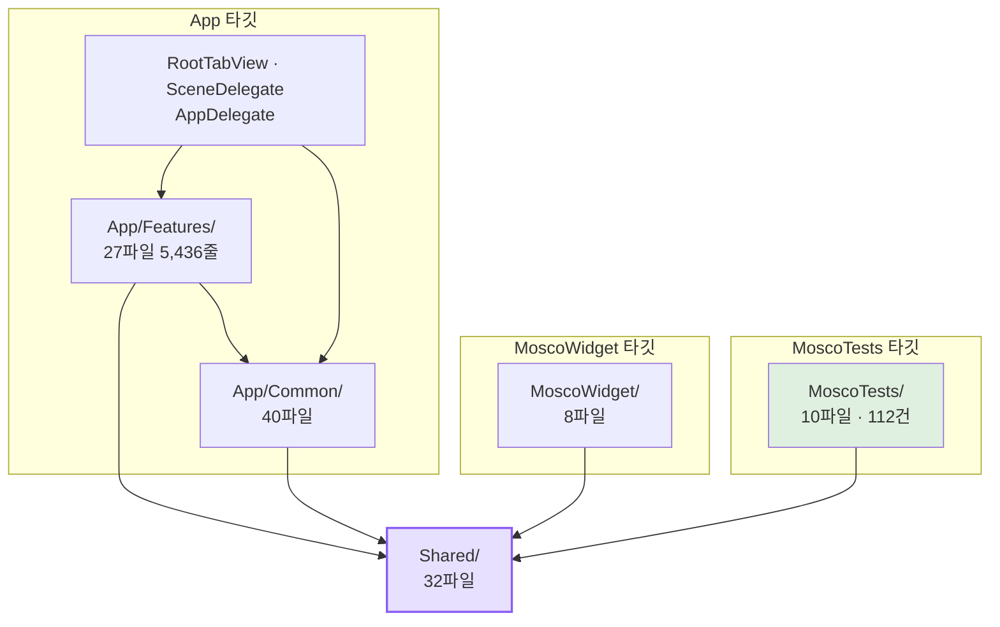

# 지금 구조

2026-08-22에 소스 전체(Swift 106파일 13,964줄)를 훑고 정리한 것이다. 세 갈래로
나눠 조사했다 — `App/Features/`, `Shared/`, `App/Common/` + `MoscoWidget/`.

**이 문서는 진단이 아니라 지도다.** 무엇을 어떻게 고칠지는
[`PATTERNS.md`](PATTERNS.md)에서 다룬다.

## 한눈에

**`Shared/`가 세 타깃 모두에 들어간다.** 그리고 테스트 타깃은 `Shared/`와
`MoscoTests/`만 컴파일한다 — 호스트 앱이 없다.

여기서 이 프로젝트의 **가장 중요한 구조적 사실**이 나온다.

> **테스트를 쓸 수 있는 코드와 없는 코드가 이미 폴더로 갈려 있다.**
> `Shared/`에 있으면 테스트할 수 있고, `App/`에 있으면 못 한다.

레이어 이름을 새로 붙일 필요가 없다. 경계는 이미 있고, **문제는 로직이 잘못된 쪽에
많이 있다**는 것이다.

## 레이어별 현황

### `Shared/` — 32파일, 세 타깃 공유

| 갈래 | 개수 | 예 |
|---|---|---|
| SwiftData 모델 | 5 | `TodoItem`, `TodoCategory`, `TodoCalendar` + 확장 2 |
| 순수 계산 | 14 | `MonthLayout`, `TimelineLayout`, `TimeExpressionParser`, `PermissionGate`, `CalendarEventExpander` |
| 저장소·전역 접근 | 5 | `SharedModelContainer`, `ThemeStore`, `Analytics`, `TodoCompletionWriter` |
| 시스템 연동 | 3 | `TodoLiveActivityController`, `TodoActivityAttributes`, 인텐트 |
| 그 밖 | 5 | `Date+Korean`, `KoreanHoliday`, `ThemeColor`, `AnalyticsIdentity`, `CalendarDayTone` |

**잘 되어 있는 것**: 순수 계산 14개는 대부분 테스트가 붙어 있고, `nonisolated`
표시가 필요한 자리에 잘 붙어 있다. `TodoSnapshot`은 SwiftData 모델을 값 사본으로
바꿔주는 경로를 일부러 열어둬서 테스트가 가능하다.

**섞여 있는 것 7개**: 한 파일 안에 순수 로직과 부작용이 같이 있다.
`Analytics`(이벤트 정의는 순수, 전역 상태는 아님), `AnalyticsIdentity`(결정 규칙은
순수, 저장소 어댑터는 아님), `MonthLayout`(계산은 순수, 같은 파일의
`MonthGridCache`는 무한히 자라는 정적 딕셔너리), `KoreanHoliday`(계산은 순수, 정적
캐시가 붙어 있음), `CategoryColorPalette`, `TodoCalendar`, `TodoSnapshot`.

**테스트가 없는데 진짜 로직인 것 9개**. 값 순서로 위 셋만 적으면,

1. `KoreanHoliday` (199줄) — 음력 변환, 대체공휴일 4규칙, 연휴 겹침 회피. 주석이
   2025년 어린이날 사례를 콕 집어 설명하는데 그 케이스를 지키는 테스트가 없다.
2. `TodoItem+Recurrence` (96줄) — **`TodoSnapshot` 쪽 복사본만 테스트가 있고 모델
   쪽은 한 줄도 없다.** 앱 화면·알림·위젯이 실제로 부르는 건 모델 쪽이다.
3. `CalendarSnapshotBuilder` — 앱과 위젯이 같은 달력 그림을 그리게 하는 핵심.
   구성 요소는 각각 덮였는데 엮는 부분이 안 덮였다.

### `App/Features/` — 27파일 5,436줄, 테스트 0

화면 셋(Calendar 20파일, TodayTodo 1파일, Settings 4파일)이다. **이 폴더에는 테스트가
하나도 없다.** 구조상 못 쓴다.

가장 큰 문제는 **뷰 안에 비자명 로직이 50곳 넘게 있다**는 것이다. 갈래별로 세면
날짜/시간 계산 13곳, 정렬·필터 8곳, 파싱·문자열 8곳, 레이아웃 산술 16곳,
지속성·부수효과 9곳이다.

특히 아픈 자리 셋을 꼽으면,

- `QuickAddView:481-536` — 오전/오후 모호성 해소 56줄. `TimeExpressionParser`는
  원자 값만 주고 **정책은 전부 뷰 안에** 있다. 옆에 `TimeExpressionParserTests`
  21건이 이미 있는데 정작 정책은 안 덮인다.
- `EventScheduleSheet:181-214` — 반복 × 종일 × 종료 조합의 날짜 확정. 틀리면
  데이터가 조용히 망가진다.
- `TodayTodoScreen:64-157` — 파생 컬렉션 8개(지난 할 일, 디데이, 검색, 정렬). 전부
  "말로 된 규칙"인데 검증이 없다.

**같은 로직의 복사본 20건**도 여기서 나온다. 그중 실제로 갈라진 것이 하나 있다 —
목록 정렬 비교자가 `TodayTodoScreen`은 2단, `DayTodosContentView`는 3단이다. 같은
할 일이 화면에 따라 다른 자리에 설 수 있다.

### `App/Common/` — 40파일

디자인 시스템, 튜토리얼, ML, 날씨, 동기화, 알림, 애널리틱스, 리뷰, 클립보드.

**시스템 API를 가짜로 바꿀 수 있는 곳은 둘뿐이다.** `Analytics`는 `AnalyticsSink`
프로토콜이 있고, ML은 `CategoryClassifying` 프로토콜이 있다(다만 뷰가 구체 타입을
직접 만들어서 주입이 안 된다). 날씨·알림·동기화는 시스템 타입을 안에서 직접 잡는다.

그리고 **`Common/`은 App 타깃에만 있으므로 어차피 테스트에서 안 보인다.**

### `MoscoWidget/` — 8파일

`Shared/`만 보고 산다. `App/Common/`을 못 쓰므로 디자인 토큰도 못 쓴다 — 폰트·간격이
전부 리터럴이다. 테마 색만 App Group UserDefaults를 통해 따라간다.

## 결합이 센 다섯 곳

1. **`RootTabView` (396줄)** — 앱의 유일한 조립 지점이자 조율자. 스토어 5개를 만들어
   주입하고, 그 외에 **최소 13가지 일**을 한다(탭 제어, 튜토리얼 강제 이동, 리뷰
   발사, 시딩, iCloud 중복 병합, 알림 재예약 키 계산, 라이브 액티비티 핑거프린트,
   위젯 리로드, 날씨 로드, 권한 순서, 분석 배출). 새 전역 상태가 생기면 반드시 이
   파일이 바뀌고, 이 뷰 없이는 어떤 화면도 프리뷰가 안 된다.

2. **`TutorialStep` enum이 화면 레이아웃을 안다** — `holeInsets`의 `top: 66`은
   `QuickAddView` 시간칩 높이이고, `holeRadius`는 각 뷰의 코너 반경이다. 입력창
   디자인을 바꾸면 이 enum을 고쳐야 하고, 단계를 하나 추가하면 열 군데를 동시에
   고쳐야 한다.

3. **문자열 핑거프린트 두 개** — `RootTabView:55`와 `:86`이 `TodoItem` 필드를 손으로
   나열해서 "언제 다시 계산할지"를 정한다. 필드를 추가하고 여기 안 넣으면 조용히
   갱신이 안 된다. 주석이 메모 누락으로 실제 그 버그를 겪었다고 적어뒀다.

4. **튜토리얼 창과 코디네이터의 양방향 싱글턴** — `PassthroughWindow.hitTest`가 매
   터치마다 `TutorialCoordinator.shared`를 읽고, 코디네이터는 창을 직접 켜고 끈다.
   둘 다 `static let shared`라 어느 쪽도 따로 검증할 수 없다.

5. **디자인 토큰이 저장소 싱글턴에 묶여 있다** — `MoscoPalette.accent`가
   `ThemeStore.shared`를 읽고, 그건 App Group UserDefaults다. 색 하나 참조하는 순수한
   뷰도 메인 액터와 App Group 설정을 요구한다.

## 데이터 접근이 두 갈래다

같은 앱 안에 **완전히 다른 두 방식**이 공존한다.

| | 방식 | 쓰는 곳 |
|---|---|---|
| A | `TodoQueryBridge`가 리프에서 `@Query`를 격리하고, 값 스냅샷을 백그라운드에서 만든다 | 달력 화면 |
| B | 뷰 본체에 `@Query`를 놓고 매 `body`마다 필터·정렬 | 오늘 할 일, 하루치, 빠른 입력 |

A는 성능 문제를 겪고 나서 만든 구조이고 주석이 그 경위를 적어뒀다. B는 그전 방식이
그대로 남은 것이다. 그리고 A의 주석은 "캘린더 필터는 여기 한 곳에서만"이라고
말하는데 **실제로는 네 곳에서 각자 필터링하고 있다.**

## 품질 기준선 (2026-08-22)

리팩터링을 시작하기 전에 찍어두는 숫자다. 나중에 "좋아졌는가"에 답하려면 출발점이
있어야 한다.

| 항목 | 값 |
|---|---|
| Swift 파일 · 줄 | 106 · 13,964 |
| 테스트 | 112건 / 9스위트 (전부 `Shared/` 대상) |
| Features 폴더의 테스트 | **0** |
| 뷰 안의 비자명 로직 | **50곳 이상** |
| 한 파일 최대 책임 수 | **11** (`QuickAddView` 679줄) |
| 500줄 넘는 파일 | 3 (`QuickAddView` 679, `TodayTodoScreen` 662, `SettingsScreen` 538) |
| 같은 로직의 복사본 | **20건** |
| Feature 간 순환 의존 | 1쌍 (Calendar ↔ Settings) |
| 테스트 없는 순수 로직 | 9개 |
| 시스템 API를 가짜로 못 바꾸는 모듈 | 4 (날씨·알림·동기화·저장소) |
| 디자인 토큰 우회 | 폰트 33곳, 여백 42곳, 반경 3곳 |
| 싱글턴·전역 가변 상태 | 11 |
| 조건부 컴파일 분기 | 6 |

두 가지 방법으로 셌고 값이 조금 다르다. **위 표는 사람(조사 에이전트)이 읽어서 센
것**이고, `tools/quality_baseline.py`는 정규식으로 센다. 예를 들어 "뷰 안의 비자명
로직"은 사람이 50곳, 스크립트가 71건으로 센다 — 스크립트는 한 함수 안의 여러 호출을
따로 세고 `App/Common/`의 뷰도 포함한다.

**추세를 볼 때는 스크립트 값을 쓴다.** 사람이 센 값은 매번 달라지고, 스크립트는 같은
방법으로 센다. 아래가 스크립트 기준 2026-08-22 값이다.

| 항목 | 스크립트 값 |
|---|---|
| 뷰 안의 비자명 로직 | 71 (날짜 36 · 정렬·필터 19 · 저장소 14 · 문자열 2) |
| 500줄 넘는 파일 | 3 |
| 싱글턴 | 4 |
| 조건부 컴파일 | 15 |
| 폰트 하드코딩 | 48 |
| 숫자 여백 | 59 |
| `// TEMP:` 잔존 | 0 |

## 잘 되어 있는 것도 적는다

진단만 적으면 다 뜯어고쳐야 할 것처럼 보이는데, 그렇지 않다.

- **순수 로직을 뽑아 테스트하는 습관이 이미 자리 잡았다.** 112건이 그 증거이고,
  `TimeExpressionParser`는 뷰 안에 있던 것을 꺼내서 21건을 붙인 실제 사례다.
- **되돌린 결정을 문서로 남긴다.** `DesignSystem/README.md`와 `docs/TRAPS.md`가
  실제로 작동하고 있다 — 규범 드리프트 지표가 두 버전 연속 0이다.
- **주석이 "왜"를 적는다.** 이 조사가 빨랐던 이유의 절반이 주석이다. 대부분의
  이상해 보이는 코드 옆에 그렇게 한 이유가 적혀 있었다.
- **앱과 위젯이 계산을 공유한다.** `CalendarSnapshotBuilder`를 양쪽이 같이 써서 같은
  그림을 그린다. 이건 많은 앱이 못 하는 것이다.
- **동시성 표시가 대체로 정확하다.** 기본이 `MainActor`인 설정에서 백그라운드로
  가야 하는 것마다 `nonisolated`가 붙어 있다.
