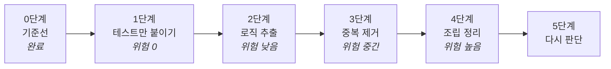

# 리팩터링 준비

**아직 아무것도 시작하지 않았다.** 이 문서는 "무엇을 어떤 순서로 할 것인가"에 대한
제안이고, 착수는 같이 정한다.

순서를 정할 때 쓴 기준 하나: **위험이 낮은 것부터.** 여기서 위험은 "잘못됐을 때
알아차리기 어려운 정도"다. 테스트를 쓰는 일은 위험이 0이고, 조립을 바꾸는 일은
높다. 그리고 앞 단계가 뒤 단계의 안전망이 된다.



---

## 0단계 — 기준선 (완료)

`tools/quality_baseline.py`로 2026-08-22 값을 찍었다. 숫자는
[`CURRENT.md`](CURRENT.md)에 있다. **바꾸기 전 값이 있어야 "좋아졌다"를 말할 수 있다.**

같이 만든 `tools/artifact_check.sh`는 계약 검증용이다. 두 스크립트를 CI에 물릴지는
1단계와 같이 정한다.

---

## 1단계 — 옮기지 않고 테스트만 붙인다 (위험 0)

**이미 `Shared/`에 있는데 테스트가 없는 것들이다.** 코드를 한 줄도 안 옮기므로
동작이 바뀔 수 없다. 그런데 이 아홉 개가 앱에서 제일 자주 불린다.

| # | 대상 | 줄 | 왜 먼저인가 |
|---|---|---:|---|
| 1 | `KoreanHoliday` | 199 | 음력 변환, 대체공휴일 4규칙, 연휴 겹침 회피. **가장 큰 무커버리지 덩어리**이고 주석이 2025년 어린이날 사례를 콕 집어 설명하는데 그 케이스를 지키는 테스트가 없다 |
| 2 | `TodoItem+Recurrence` | 96 | `TodoSnapshot` 쪽 복사본만 테스트가 있다. **앱·알림·위젯이 실제로 부르는 건 모델 쪽**인데 한 줄도 안 덮였다. 두 구현이 같아야 한다는 주석까지 있다 |
| 3 | `CalendarSnapshotBuilder` | — | 앱과 위젯이 같은 달력을 그리게 하는 핵심. 부품은 덮였는데 엮는 부분이 안 덮였다 |
| 4 | `CalendarSelection` | 25 | 순수 함수 넷. "숨긴 쪽을 저장한다"는 반전 규칙이 깨지면 **데이터가 통째로 사라진 것처럼 보인다.** 여섯 화면이 쓴다 |
| 5 | `MonthPageMetrics` | 68 | 이미 순수 struct인데 미테스트. `barCapacity` 경계는 맥 창 최소 크기의 근거이기도 하다 |
| 6 | `AnalyticsEvent`의 이름·파라미터 | 90 | `notification_open`이 Firebase 예약어라 이름을 바꿨다는 주석이 있는데 그 이름을 고정하는 테스트가 없다 |
| 7 | `WidgetDeepLink` | 14 | URL 왕복. 5줄짜리인데 테스트 0 |
| 8 | `CalendarMonth`의 `floorDiv` | — | 음수 처리를 주석이 일부러 설명하는데 테스트가 없다 |
| 9 | `Date+Korean`의 `dDayLabel`·`koreanTime` | — | D-DAY/D-n 경계. `koreanTime`은 `TimeExpressionParser`와 같은 로직의 두 번째 복사본이라 **둘이 같은지**도 같이 본다 |

**끝났다고 판정하는 기준**: 아홉 개 전부에 테스트가 붙고, `MonthLayoutTests`처럼
이름에 증상이 적혀 있고, 전체가 통과한다. 예상 테스트 수 +60~90건.

**PR 단위**: 대상 하나에 PR 하나. 되돌릴 일이 없지만 리뷰가 쉬워진다.

**위임**: `test-author` 에이전트 후보다. 규칙이 명확하고 반복적이다.

---

## 2단계 — 뷰 안의 로직을 `Shared/`로 (위험 낮음)

여기부터 코드가 움직인다. **한 번에 하나씩, PR 하나에 하나씩.**

값이 큰 순서다. "값"은 (깨졌을 때의 손해) × (지금 검증이 없는 정도)로 봤다.

| # | 무엇 | 지금 위치 | 옮길 곳(제안) | 테스트로 덮을 것 |
|---|---|---|---|---|
| 1 | 오전/오후 모호성 해소 정책 (56줄) | `QuickAddView:481-536` | `Shared/TimeSuggestionPolicy` | "11시~1시는 정오를 넘긴다", "6시~7시는 후보 셋" |
| 2 | 일정 확정 규칙 (반복×종일×종료) | `EventScheduleSheet:181-214` | `Shared/SchedulePlan` | 네 조합의 시작·종료 확정. 틀리면 데이터가 조용히 망가진다 |
| 3 | 목록 파생 규칙 넷 | `TodayTodoScreen:64-157` | `Shared/TodoListRules` | "반복은 지난 것이 아니다", "지난 디데이 제외", nil 날짜 4-case 비교 |
| 4 | 정렬 비교자 **통합** | `TodayTodoScreen:121` + `DayTodosContentView:286` | `Shared/TodoOrdering` | **두 화면이 같은 순서를 낸다** (지금 2단 vs 3단으로 갈려 있다) |
| 5 | 일정 라벨 정책 **통합** | `TodoRow:288` + `TodoDetailSheet:141` | `Shared/ScheduleLabel` | 멀티데이·시간만·날짜포함 분기 |
| 6 | 막대 넘침 계산 | `WeekBarsView:27-64` | `Shared/MonthEventLayout`에 합류 | 7열 카운팅, `+N` 경계 |
| 7 | 타임라인 픽셀 환산 | `DayTimelineView:201-248` | `Shared/TimelineLayout`에 합류 | 같은 공식 세 벌이 일치하는지 |
| 8 | 동기화 상태 → 문구·심볼 | `SettingsScreen:382-413` | `Shared/CloudSyncPresentation` | 5-state × 3출력 전수 |
| 9 | 칩 라벨 ("전체"/이름/"N개") | `CalendarScreen:231-242` | `Shared/CalendarChip` | "전체 == 개수 같을 때" 경계 |
| 10 | 알림 리드타임 라벨 | `CategoryEditorSheet:148` | `Shared/LeadTimeLabel` | 0/59/60/120 경계 |
| 11 | 디데이 라벨 | `TodayTodoScreen:628` | 1단계 9번과 합침 | — |
| 12 | 터치 판정(이동 임계·풀다운) | `CellTouchBridge:97-133` | `Shared/TouchDecision` | 주석에 "실기기에서만 재현"이라 적힌 버그 이력이 있다 |
| 13 | 저장 시 필드 전파 규칙 | `QuickAddView:592-659` | `Shared/TodoDraft` | `startDate == nil`이 일곱 필드에 퍼지는 규칙 |

### 하는 방법 — 기대값을 원본에서 뽑는다

**뷰 안에 있는 로직은 테스트를 쓸 수가 없다.** 테스트 타깃이 `App/`을 못 본다.
그래서 "리팩터링 전에 테스트"를 글자 그대로 적용하면 시작을 못 한다 — 테스트를
쓰려면 옮겨야 하고, 옮기는 게 리팩터링이다.

여기에 함정이 하나 있다. 옮긴 **뒤에** 테스트를 쓰면, **옮기다 생긴 실수가 정답으로
굳는다.** 56줄짜리 정책을 복사하다 조건 하나를 뒤집어놓고 그 상태에 테스트를 쓰면
컴파일도 통과하고 테스트도 초록이다.

그래서 **기대값을 옮기기 전 원본에서 뽑는다.**

1. 원본 함수에 임시 출력 코드를 넣는다 — `// TEMP:` 표식을 단다 (R11)
2. 입력 20~30개를 넣어 **지금 출력을 받아 적는다.** 이게 기대값이다.
   분기마다 최소 둘, 경계값 위주로 뽑는다
3. 임시 코드를 걷는다 (`grep -rn "TEMP:" Mosco/`)
4. 순수 함수/값 타입으로 뽑아 `Shared/`에 새 파일로 만든다. **로직은 한 글자도
   안 바꾼다** — 이름도 그대로 둔다. diff가 "잘라내고 붙여넣기"로 읽혀야 한다
5. 2번에서 받은 값을 기대값으로 테스트를 쓴다. **옮기다 틀렸으면 여기서 빨개진다**
6. 뷰가 새 타입을 부르게 바꾼다
7. 빌드 + 테스트 + `quality_baseline.py`로 "뷰 안의 로직" 수치가 내려갔는지 확인

**남는 위험 둘을 정직하게 적는다.**

- 입력을 안 뽑은 경로는 못 잡는다. 30개로 5분기를 다 덮지는 못한다
- 지금 동작이 이미 버그면 그 버그가 고정된다. **이건 의도한 것이다** — 리팩터링
  PR에서는 동작을 안 바꾸고, 이상한 것을 발견하면 별도 항목으로 적어 따로 고친다.
  섞으면 사고가 나도 원인을 못 가린다

### 옮길 때마다 세 줄 기록한다

추출은 작업이면서 **조사**다. 뽑아보면 읽어서는 모르는 것이 드러나고, 그 정보가
아키텍처 판단의 근거가 된다. 그냥 하면 날아가므로 대상마다 세 줄을 남긴다.

```
무엇과 같이 움직였나   같이 뽑혀야 했던 타입 — 도메인 경계의 힌트
뷰에 무엇이 남았나     렌더만인가, 상태 조율도 남는가
@Query가 필요했나      값 배열로 충분했나
```

**적는 자리는 PR 본문**이다. 답 끝에 적는 방식은 v1.2.0에서 한 번도 안 남았다.

13개가 쌓이면 [`PATTERNS.md`](PATTERNS.md)의 적합도 열을 **추론이 아니라 관측으로**
다시 채운다. 그때가 이름 붙은 아키텍처가 필요한지 판단할 시점이다.

**끝났다고 판정하는 기준**: 스크립트의 "뷰 안의 비자명 로직"이 71 → 30 이하.

**주의**: 4번과 5번은 **두 화면의 동작을 하나로 맞추는 것**이라 사용자에게 보이는
변화가 있을 수 있다. 이 둘은 🔴(반드시 확인)이고 검증 카드가 필요하다.

---

## 3단계 — 중복 걷어내기 (위험 중간)

조사가 찾은 복사본 20건 중, 2단계에서 자동으로 사라지는 것을 빼고 남는 것들이다.

| 무엇 | 몇 벌 | 어떻게 |
|---|---|---|
| 목록 재인덱싱 `move` | 2 | `Shared`로 하나 |
| `showsCalendarTag` | 2 | 한 글자도 안 다르다. 하나로 |
| `dismissKeyboard` | 3 | 뷰 확장 하나로 |
| 캘린더 가시성 필터 | 4 | 1단계 4번(`CalendarSelection`)으로 모은다 |
| 권한 토글 바인딩 | 3 | 공통 컴포넌트 하나 (`PermissionToggle`) |
| 에디터 시트 쌍 | 2 | 카테고리/캘린더가 알림 섹션 빼고 같다 |
| 목록 화면 쌍 | 2 | 위와 같은 이유 |
| `weekendKind(column:)` | 2 | `Shared`로 |
| 리스트 행 3종 세트 | 8 | 뷰 확장 하나 |

**주의**: 에디터 시트와 목록 화면을 합치는 것은 **추상화를 하나 만드는 일**이라
성격이 다르다. 잘못 합치면 나중에 갈라질 때 더 비싸다. 이 둘은 마지막에 하거나 안
해도 된다.

---

## 4단계 — 조립 정리 (위험 높음)

`RootTabView`가 지고 있는 13가지를 쪼갠다. 여기부터는 앱 전체가 걸리므로 **1~3단계가
끝나 테스트가 충분히 쌓인 뒤에** 한다.

쪼갤 후보는 이렇다.

- 시딩·iCloud 중복 병합 → `AppBootstrap`
- 알림 재예약 키 + 라이브 액티비티 핑거프린트 → **문자열 조립을 그만두고** 모델
  변경 감지로 바꿀지 검토 (지금은 필드를 손으로 나열한다)
- 튜토리얼 탭 강제 이동 → 코디네이터 쪽으로
- 권한 요청 순서 → 이미 `StartupPermissionRequest`가 있다. 거기로 모은다

**같이 볼 것**: 싱글턴 11개를 주입으로 모으는 일(`PATTERNS.md` B3)과 겹친다.
프리뷰가 살아나는 것이 부수 효과인데, 그게 생각보다 크다 — 지금은 화면 하나를
따로 띄워볼 수 없다.

---

## 5단계 — 그때 다시 판단

1~4단계가 끝나면 남은 문제가 지금과 다르게 보일 것이다. 그 시점에 정할 것들이다.

- **호스트 앱을 붙일 것인가** (UI 테스트·제스처 검증). 지금 R7이 "UI 테스트도
  만든다"고 적어놓고 못 하고 있어서 **어느 쪽이든 정해야 한다**
- **SPM 모듈로 쪼갤 것인가** (컴파일러가 의존 방향을 강제)
- **화면 상태를 struct 하나로 모을 것인가** (`PATTERNS.md` B5)

---

## 규칙 — 이 리팩터링을 하는 동안

1. **PR 하나에 대상 하나.** 되돌리기가 전부다.
2. **기대값을 원본에서 뽑는다.** 옮긴 뒤에 기대값을 정하면 옮기다 생긴 버그를
   테스트가 그대로 고정한다. 위 "하는 방법" 참고.
3. **동작을 바꾸지 않는다.** 바꿔야 할 것을 발견하면 별도 항목으로 적고 따로 한다.
   리팩터링 PR에 기능 변경이 섞이면 사고가 나도 원인을 못 가린다.
4. **매 PR에 `quality_baseline.py` 결과를 붙인다.** 숫자가 안 내려가면 그 PR은
   리팩터링이 아니라 이사다.
5. **`docs/review-criteria.md`의 등급을 PR마다 붙인다.** 4번(정렬)과 5번(라벨)처럼
   사용자에게 보이는 변화가 있는 것은 🔴이다.

## 규모 감

| 단계 | 대상 | 예상 | 위험 |
|---|---|---|---|
| 1 | 9개에 테스트 | 2~3일 (위임 가능) | 없음 |
| 2 | 13개 추출 | 4~6일 | 낮음. 둘만 🔴 |
| 3 | 중복 9종 | 2~3일 | 중간 |
| 4 | 조립 정리 | 3~5일 | 높음 |

**한 번에 다 하지 않는다.** 1단계만 해도 테스트가 두 배가 되고, 그것만으로 다음
단계가 훨씬 안전해진다.
