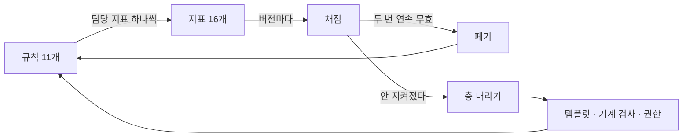

# AI 워크플로우를 어떻게 만들었나

혼자 iOS 앱을 만들고 코드는 대부분 AI가 쓴다. 넉 달 전까지는 새벽에 작업을 시작하면 한
시간 만에 요금제 한도가 차서 그날이 끝났다. 원인을 찾아보니 요청량이 아니라, 대화가
길어질수록 앞의 내용을 계속 다시 읽는 구조에 있었다. 그래서 AI에게 일을 맡기는 방식 자체를
관리 대상으로 삼았다. 규칙을 만들고, 규칙마다 채점할 지표를 붙이고, 효과가 없는 규칙은
버리는 체계다. 넉 달 뒤 프롬프트 하나에 드는 토큰이 17.1M에서 6.8M으로 줄었고 같은
한도로 하룻밤을 작업하게 됐다.

이 글은 그 체계가 만들어지기까지를 버전 순서대로 적은 기록이다. 성공만 적힌 회고는
믿기지 않으므로 잘못 옮긴 규칙, 규칙과 다른 것을 세고 있던 지표, 스스로를 잠가서 세 버전
동안 한 번도 작동하지 못한 규칙까지 같이 적는다.

## 한 시간이면 한도가 찼다

Mosco는 한 줄로 할 일을 적으면 온디바이스 임베딩이 카테고리를 붙여주는 캘린더 앱이고,
기획부터 배포까지 혼자 한다. 코드를 대부분 AI가 쓰기 때문에 개발 속도는 내가 타이핑하는
속도가 아니라 AI와 주고받는 횟수에 걸려 있다. 요금제는 Claude Pro라 한도가 차면 그날
작업은 거기서 멈춘다.

작업 시간대가 문제를 키웠다. 프롬프트의 40%가 0시에서 5시 사이에 나오는데, 그 시간에
시작해 한 시간 만에 한도가 차면 남는 것은 절반쯤 만들다 만 기능과 다음 날로 넘어간 할 일뿐이다.
같은 자리에서 반복되는 소모도 있었다. 브랜치를 먼저 만들라거나 커밋 메시지를 어떤 형식으로
쓰라는 말을 매번 설명했는데 다음 세션이 시작되면 매번 잊혔다.

풀어야 할 문제는 분명했다. 한도 안에서 하룻밤을 버티는 상태를 만들어야 했고, 그러려면
무엇이 비용을 만드는지부터 알아야 했다. 코드 품질은 처음부터 문제가 아니었다.

## 비용은 어디에 붙는가

첫 작업은 규칙을 만드는 것이 아니라 세는 것이었다. 대화 기록이 JSONL로 남아 있어서
파싱해 토큰을 성분별로 갈라봤다. 12일치를 집계하니 답이 한눈에 나왔다. 이미 있던 맥락을
다시 읽는 캐시 읽기가 97.5%였고, 새로 만들어낸 출력은 0.24%였다.

이 비율을 이해하려면 턴을 알아야 한다. 프롬프트 하나를 처리하는 동안 AI는 파일을 읽고
도구를 부르고 결과를 확인하기를 여러 번 반복하는데, 그 한 사이클이 턴이다. 그리고 AI는
턴마다 지금까지의 대화를 통째로 다시 읽는다. 12일 동안 프롬프트 180개에 턴이 6,444번
돌았으니, 프롬프트 하나마다 앞의 대화를 평균 서른여섯 번 다시 읽었다.

비용이 어디에 붙는지가 여기서 갈린다. 잘못 만들어서 되돌리면 그 왕복이 대화에 남고 이후
모든 턴이 그 왕복을 다시 읽는다. 스크린샷도 찍은 턴만 비싼 것이 아니라 그 뒤 모든 턴이
비싸진다. 같은 지시를 반복하는 것도 다르지 않아서, 열 번 설명하면 열 번 값을 치른다.
비용은 행동 하나에 붙는 것이 아니라 **그 행동이 대화에 남긴 것**에 붙는다.

그래서 줄여야 할 대상이 정해졌다. 작업량이 아니라 대화에 쌓이는 것이었다.

## v1.0.0 — 아무 장치도 없던 12일

첫 버전은 규칙 없이 갔다. 프롬프트 180개, 12일, 코드 10,907줄. 의도한 실험은 아니었지만
아무 장치도 걸려 있지 않은 구간이라 그대로 기준선이 됐다.

집계 결과가 좋지 않았다. 다시 시켜야 했던 프롬프트가 31.1%였고, 시뮬레이터를 1,015회
조작하면서 스크린샷을 391장 남겼다. 파일을 읽을 때 범위를 지정하지 않고 통째로 읽은 비율이
67.7%, 넓은 조사를 서브에이전트에 넘긴 비율은 0%, 회귀 테스트는 한 건도 없었다.

두 지표를 교차했을 때 하나가 더 드러났다. 여러 항목을 한 번에 요청한 다음 재지시가 올
확률이 하나만 요청한 다음보다 1.27배 높았다. 목록으로 요청하면 일부만 조용히 처리됐기
때문이다. 한번은 14개짜리 목록을 요청했는데 절반이 그 뒤로 다시 언급되지 않았다. 나도
잊었고 AI도 잊었다.

숫자가 말해준 것은 AI의 코딩 실력이 아니었다. 되돌리고, 화면을 뒤지고, 같은 말을 반복하는
주고받음이 비용의 대부분을 만들고 있었다. 고칠 대상은 코드가 아니라 프로세스였다.

## v1.1.0 — 규칙을 만들었는데 하나를 잘못 옮겼다

두 번째 버전도 여전히 규칙 없이 갔고, 더 나빠졌다. 프롬프트당 토큰이 17.1M에서 31.1M으로
1.8배가 됐고 재지시율은 44.8%까지 올랐다. 3일 동안 29개 프롬프트를 처리하면서 스크린샷을
229장 찍은 것이 컸다. 짧은 구간에 무거운 컨텍스트가 집중되면 뒤의 모든 턴이 그 무게를
그대로 다시 읽는다.

이 구간을 정리하면서 처음으로 규칙 열 개를 문서로 만들었다. 그런데 규칙을 쓰는 과정에서
사고가 하나 났다. 세션 기록에 "시뮬레이터 사용은 나한테 부탁하고 쓰지 마"라는 요청이 두 번
있었는데, 나는 그것을 "AI가 합격 판정까지 내리는 것이 문제"라고 해석했다. 그래서 판정은
사람이 한다는 규칙을 만들고, 시뮬레이터 조작 자체는 오히려 규칙으로 못박아버렸다. 요청은
쓰지 말라는 것이었는데 규칙은 쓰되 판정만 넘기라는 것이 됐다.

요약하는 과정에 해석이 끼어들면 원본과 다른 문장이 나온다. 더 나쁜 것은 그 왜곡을 잡을
방법이 없었다는 점이다. 규칙에 담당 지표가 붙어 있지 않았으므로 규칙이 의도대로 작동하는지
확인할 수단이 처음부터 없었다. 지금은 요청을 규칙으로 옮길 때 원문과 만든 문장을 나란히
놓고 대조한다.

## 무엇을 규칙으로 만들 것인가

같은 요청이 세 번째로 나오고 나서야 규칙을 다시 봤다. 잘못 옮긴 규칙을 폐기하고 시뮬레이터
전면 금지로 바꿨고, 이때 토큰만 담당하는 규칙 셋을 새로 넣었다. 규칙을 고르는 기준을 먼저
정했기 때문에 셋으로 정리됐다.

기준은 두 가지다. 채점할 수 있어야 하고, AI가 통제할 수 있어야 한다. 후보는 넷이었는데
읽는 범위를 좁히는 것은 전체 읽기가 67.7%라 여지가 컸고, 넓은 조사를 위임하는 것은 위임
비중이 0%였고, 작업 크기를 말하고 모델을 고르는 것은 상위 모델 비중이 46.8%에서 100%로
올랐는데도 아무도 그 숫자를 보고 있지 않았다. 반면 대화 길이 자체를 제한하자는 후보는
버렸다. 세션을 끊는 것은 사람이 하는 일이라 AI가 통제할 수 없고, 통제할 수 없는 것을
규칙으로 만들면 지켜지지 않는 문장이 하나 더 늘어날 뿐이다.

규칙보다 지표를 먼저 정의한 이유도 같은 자리에 있다. 규칙은 만들기 쉽지만 지켜졌는지
알기 어렵고, 확인할 방법이 없으면 좋아졌는지 모르는 채로 문서만 두꺼워진다. 그래서 지표에
세 조건을 걸었다. 대화 기록에서 자동으로 뽑을 수 있을 것, 규칙 하나에 담당 지표를 하나씩
붙일 것, 그리고 최종 지표는 하나만 둘 것. 손으로 집계하는 지표는 두 번째 버전부터 아무도
집계하지 않고, 담당 지표가 없는 규칙은 채점할 수 없다. 최종 지표를 하나로 둔 것은 나머지가
모두 좋아져도 프롬프트당 토큰이 오르면 그 버전을 실패로 적기 위해서다.

채점은 버전마다 규칙별로 넷 중 하나를 매긴다. 담당 지표가 의도한 방향으로 움직였으면 효과,
반대로 갔거나 그대로면 무효, 표본이 적어 흔들리면 미확인, 데이터가 아예 없으면 미측정이다.
무효가 두 번 연속이면 폐기한다. 미확인과 미측정을 굳이 나눈 판단이 나중에 값을 했는데,
데이터가 없는 것을 효과 없음으로 읽고 지웠다면 효과 있었을 규칙을 잃었을 자리가 뒤에 나온다.

## v1.2.0 — 처음으로 채점했다

첫 채점 구간의 결과는 분명했다. 프롬프트당 토큰이 31.1M에서 15.0M으로 52% 줄었고,
시뮬레이터 조작이 716회에서 26회로, 턴이 2,519번에서 1,259번으로 떨어졌다. 회귀 테스트는
0건에서 108건이 됐다.

테스트가 늘어난 방식이 특히 남는다. 시각을 해석하는 로직이 화면 구조체 안의 private
함수라서 한 줄도 덮을 수 없었는데, 별도 타입으로 꺼내자 곧바로 21건이 붙었다. 테스트가
없던 것이 아니라 테스트를 쓸 수 없는 자리에 있었다. 시뮬레이터를 막으면서 그 자리를 무엇으로
메울지 정해뒀기 때문에 나온 결과다. 로직이면 테스트를 쓰고, 화면이면 무엇을 어떤 순서로
확인하고 무엇이 보이면 통과인지 적은 카드를 사람에게 넘긴다.

다만 열 개 중 다섯이 미확인으로 나왔다. 프롬프트가 35개뿐이라 비율 지표를 판정할 표본이
못 됐다. 숫자가 좋게 나왔다고 예외를 두지는 않았는데, 한 번 예외를 두면 나쁘게 나온 다음
버전에도 예외를 두게 되기 때문이다.

## v1.3.0 — 문서로 안 되는 것은 층을 내렸다

세 번째 채점 구간에서 배운 것은 문서도 잊힌다는 사실이었다.

시뮬레이터 금지는 이미 규칙으로 있었는데도 또 호출됐다. 같은 요청이 세 번이나 나왔다는
것은 문서로 풀 문제가 아니라는 신호였다. 그래서 도구 자체를 권한 파일의 거부 목록에 넣었고,
얼마 뒤 AI가 그 도구를 부르자 문서가 아니라 권한 계층이 막았다. 문서였다면 예외 조항을
근거로 스스로를 설득하고 넘어갈 여지가 있었다. 덧붙이면 AI가 자기 권한 파일을 고치려
했을 때 그것도 같이 막혔다. 규칙이 자기 자신을 풀 수 없는 구조가 됐다.

강제 장치를 층으로 보게 된 것이 이 구간의 소득이다. 맨 위에는 문서에 적힌 규칙이 있는데
가장 잊히기 쉽다. 절차 문서는 부를 때만 열린다. 템플릿의 빈칸은 비어 있으면 눈에 띄니 조금
낫고, CI나 테스트 같은 기계 검사는 잊히지 않는다. 맨 아래가 권한 설정이고, 도구 자체가
막히면 우회할 수단이 없다. 같은 요청이 두 번 이상 나오면 규칙을 더 강하게 쓸 것이 아니라
더 아래 층으로 내려야 한다.

폐기 직전에 살아난 규칙도 하나 있다. 넓은 조사를 서브에이전트에 위임하라는 규칙의 담당
지표가 세 버전 연속 0%여서 폐기 기준에 정확히 걸렸다. 지우기 전에 본문을 다시 읽어보니
"서브에이전트는 사용자가 요청할 때만 실행한다"는 단서가 규칙 안에 들어 있었다. 효과가
없던 것이 아니라 규칙이 스스로를 잠가서 한 번도 시험대에 오르지 못한 상태였다. 단서를
풀고 처음 써봤을 때 조사 네 건을 병렬로 실행해 54만 토큰을 쓰고 요약만 받았다. 직접
읽었다면 그 54만 토큰이 전부 대화에 쌓여 이후 모든 턴이 다시 읽어야 했다. 무효와 실행
불가는 다르고, 지표만 보고 지웠다면 확인할 기회조차 없었다.

진단용 코드를 다루는 규칙도 이때 새로 넣었다. 원인을 좁히려고 심은 탐침과 로그가 커밋될
뻔했는데, PR 템플릿에 체크박스가 있었지만 스스로 체크하는 항목이라 작동하지 않았다.
표식을 달고 커밋 전에 걷되, 세는 일은 사람이 아니라 품질 스크립트가 하도록 옮겼다.

구간의 결과는 프롬프트당 토큰 15.0M에서 6.8M으로 55% 감소, 재지시율 12.9%, 빌드 실패율
4.8%, 턴 563번이었다. 두 구간 연속으로 토큰이 절반이 됐다.

그런데 이 채점에서 지표 쪽 문제가 셋 드러났다. 읽는 범위를 보는 지표가 33%에서 100%로
급등했는데, 규칙을 어긴 것이 아니라 읽기가 대부분 `sed`와 `grep`으로 옮겨가면서 그 지표가
세는 도구를 더 이상 쓰지 않게 된 상태였다. 커밋 종류를 세는 지표는 PR을 스쿼시 머지로
바꾸자 집계할 자리가 사라졌다. 성능을 숫자로 말하라는 규칙의 담당 지표는 AI가 아니라
사용자가 감각적인 표현을 쓴 비율을 세고 있어서, 값이 0이어도 규칙이 지켜졌다는 뜻이
되지 못했다.

행동을 바꾸는 규칙은 그 행동을 세는 계측기도 함께 바꾼다. 지표가 이상하면 규칙 위반을
의심하기 전에 그 지표가 아직 같은 대상을 보고 있는지부터 확인해야 한다.

## v1.3.1 — 토큰이 잡히자 다음 병목이 드러났다

한도 문제가 풀리고 나니 가려져 있던 것이 보였다. v1.3.0에서 잡힌 버그가 넷인데 **전부
사람이 잡았고, 테스트로 잡을 수 있었던 것은 하나도 없었다.**

버그를 네 종류로 나눠보고서야 이유를 알았다. 의도한 대로 도는지를 보는 기능 문제, 코드
바깥의 약속이 지켜지는지를 보는 계약 문제, 환경에 따라 다르게 도는지를 보는 환경 문제,
계속 고칠 수 있는 모양인지를 보는 품질 문제가 각각 다르다. 넷 중 계약이 하나, 환경이
셋이었다. iCloud 키-값 저장소 권한이 빠져 있던 문제, 그 권한을 채우자 이번에는 실기기와
CI가 초록인 채로 시뮬레이터에서만 앱이 안 뜬 문제, 맥에서만 날씨 호출 경로가 열리지 않은
문제가 그런 것들이다. 테스트가 쓸모없다는
뜻이 아니라, 테스트가 닿지 못하는 세 종류를 그동안 전부 사람에게 떠넘기고 있었다.

그래서 검증 쪽으로 넷을 했다. 무엇을 어떤 수단으로 잡는지 사다리로 정리했고, 사람이 반드시
볼 코드와 안 봐도 되는 코드를 세 축으로 갈라 세 등급을 붙였다. 기계로 옮길 수 있는 것은
스크립트로 만들어 CI 단계로 넣었는데, 산출물의 권한 파일과 버전 일치를 검사하는 것과 코드
품질 기준선을 기록하는 것 둘이다. 마지막으로 구조 문서를 쓰면서 싱글턴을 정리하고 테스트
이음매를 확보해 테스트 14건을 더 붙였다.

빌드 실패율이 0%, 시뮬레이터 호출이 0회, 재지시율이 12.5%, 회귀 테스트가 126건으로 나왔다.
그런데 최종 지표인 프롬프트당 토큰은 6.8M에서 7.5M으로 11% 올랐다.

체계를 다 갖춘 구간에서 최종 지표가 거꾸로 갔으니 그냥 넘길 수 없다. 다만 이 구간은 코드보다
문서를 대량으로 쓴 구간이라 성격이 다르다. 추가된 2,959줄의 대부분이 문서고 출력 토큰만
71만이다. 프롬프트도 24개뿐이라 판정할 표본이 못 된다. 지금 읽을 수 있는 것은 하나다.
작업의 성격이 달라지면 같은 지표가 같은 뜻으로 붙지 않는다. 다음 구간에서 코드 작업으로
돌아갔을 때 다시 내려가는지를 보고 판단한다.

## 지금의 체계

부품은 넷이고 순서대로 물린다.

규칙은 담당 지표를 하나씩 갖고, 지표는 버전마다 채점되고, 두 번 연속 효과가 없으면
폐기되고, 지켜지지 않는 규칙은 더 아래 층으로 내려간다. 하나라도 빠지면 나머지가 죽는다.
지표가 없으면 채점할 수 없고, 채점이 없으면 폐기 기준이 없고, 폐기가 없으면 지켜지지 않는
문장이 쌓이다가 결국 아무도 문서를 읽지 않게 된다.

지금 규칙이 열한 개, 지표가 열여섯 개, 지표를 뽑고 품질을 세고 산출물 계약을 검사하는
스크립트가 넷이고, CI는 위젯 빌드부터 계약 검사까지 다섯 단계를 돈다. 규칙 원문과 채점
이력은 전부 저장소에 있어서 어떤 규칙이 언제 들어왔고 어느 버전에 어떤 판정을 받았는지
줄줄이 따라갈 수 있다.

## 결과

| | v1.0.0 | v1.1.0 | v1.2.0 | v1.3.0 | v1.3.1 |
|---|---:|---:|---:|---:|---:|
| 프롬프트 | 180 | 29 | 35 | 31 | 24 |
| **프롬프트당 토큰** | 17.1M | 31.1M | 15.0M | **6.8M** | 7.5M |
| 대화 턴 | 6,444 | 2,519 | 1,259 | 563 | **282** |
| 재지시율 | 31.1% | 44.8% | 17.1% | 12.9% | **12.5%** |
| 빌드 실패율 | 12.0% | 20.6% | 15.9% | 4.8% | **0.0%** |
| 시뮬레이터 조작 | 1,015 | 716 | 26 | 18 | **0** |
| 회귀 테스트 | 0 | 0 | 108 | 112 | **126** |

토큰이 줄어든 직접적인 원인은 턴 수다. 6,444번에서 282번으로 줄었는데, 캐시 읽기가 턴마다
누적되므로 턴이 줄면 비용도 같이 준다. 턴이 준 이유는 둘이다. 되돌리는 작업이 줄었고,
한 턴이 하는 일이 커졌다. 읽기와 편집과 빌드를 한 명령으로 묶으면서 왕복 자체가 사라졌다.

숫자로 잡히지 않은 변화도 있다. 브랜치와 커밋과 PR을 어떻게 만들지 더 이상 설명하지 않는다.
검증 자산이 0개에서 126개로 늘었고, 코드가 10,907줄에서 14,216줄로 늘어나는 동안 빌드
실패율은 12%에서 0%로 내려갔다.

## 남은 한계

버전당 프롬프트가 30개 안팎이라 표본이 작고 비율 지표는 계속 흔들린다. 두 버전 연속 같은
방향일 때만 판정한다는 규칙으로 완화했지만 완전히 해결되지는 않는다.

1인 프로젝트라는 조건도 크다. 여러 사람이 같은 규칙을 따르는 환경은 겪어보지 못했고,
공유 어휘와 합의가 필요한 자리에서는 다른 답이 나올 여지가 있다.

지표가 행동을 따라오지 못하는 문제는 앞으로도 생긴다. 이미 두 번 겪었고, 겪을 때마다
정의를 고치고 이전 버전을 다시 집계해야 한다. 그리고 v1.3.1에서 최종 지표가 오른 이유가
작업 성격 때문인지 체계의 한계 때문인지는 아직 한 구간의 데이터만 있어서 말할 수 없다.

## 참고자료

- 규칙 원문 — 저장소의 `CLAUDE.md`
- 채점 원장 — `docs/harness/rules.md`, `docs/harness/metrics.tsv`
- 버전별 보고서 — `docs/harness/reports/`
- 지표 추출 스크립트 — `tools/harness_report.py`
