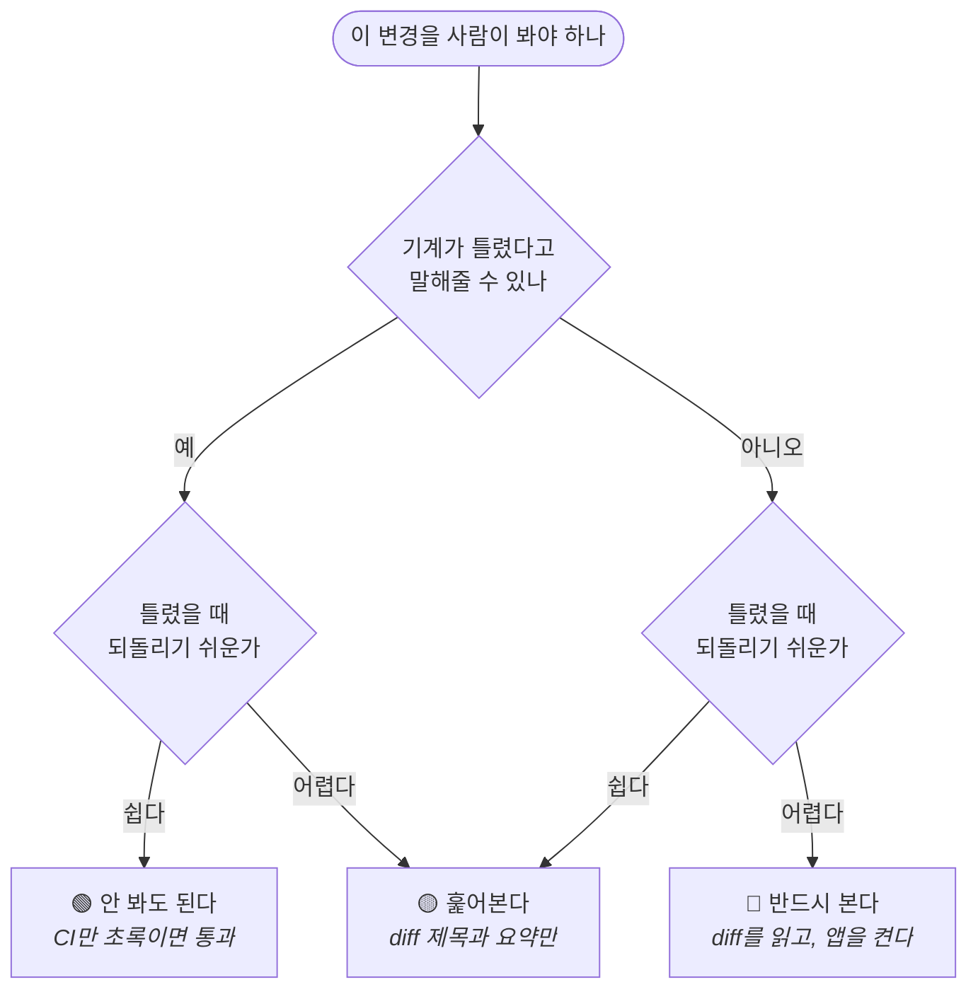

# 무엇을 사람이 봐야 하는가

혼자 만드는 앱에서 가장 비싼 자원은 **사람이 코드를 읽는 시간**이다. 전부 읽으면
AI를 쓰는 의미가 없고, 안 읽으면 조용히 망가진다. 그 사이 어디에 선을 그을지에
대한 기준이다.

먼저 용어를 나눈다. 이 문서에서 "확인"은 두 가지 다른 일을 뜻한다.

| | 무엇을 하나 | 비용 |
|---|---|---|
| **코드 확인** | diff를 읽고 판단한다 | 분 단위. 집중이 필요하다 |
| **동작 확인** | 앱을 켜서 만져본다 | 분~시간. 기기·계정·상태가 필요할 때가 있다 |

둘은 따로 정한다. 코드는 안 봐도 되는데 동작은 봐야 하는 것이 있고(예: 위젯 렌더),
그 반대도 있다(예: 삭제 로직 리팩터링).

## 판단 기준 — 두 축



**"기계가 말해줄 수 있나"** — 테스트·빌드·CI·스크립트 중 무엇이든 실패로 알려주면
예다. 사람이 안 보면 아무도 모르는 것이면 아니오다.

**"되돌리기 쉬운가"** — 커밋을 되돌리면 끝나면 쉽다. 데이터가 이미 바뀌었거나,
사용자에게 나갔거나, 스토어에 올라갔으면 어렵다.

## 세 번째 축 — 관례에서 얼마나 벗어났나

두 축(기계가 말해주나 / 되돌리기 쉬운가)만으로는 놓치는 게 있다. **같은 종류의
변경이라도 기존 패턴을 그대로 따른 것과 새 개념을 들인 것은 위험이 다르다.**

규범([`architecture/CONVENTIONS.md`](architecture/CONVENTIONS.md))이 생기면서 이걸
기계로 잴 수 있게 됐다. "이 변경이 관례 안에 있나"를 보는 것이다.

```bash
python3 tools/quality_baseline.py --since main
```

무엇을 찾나 — **새로 들인 것**들이다.

| 신호 | 왜 사람이 봐야 하나 |
|---|---|
| 새 싱글턴 (`static let shared`) | 정당한 예외는 둘뿐이다. 셋째가 생겼으면 근거가 필요하다 |
| 새 플랫폼 분기 (`#if targetEnvironment`) | 한쪽에서만 도는 코드는 다른 쪽에서 안 도는 걸 아무도 안 알려준다 |
| 새 프로토콜 | 추상화를 하나 늘리는 것이다 |
| `UserDefaults.standard` 직접 접근 | 주입받게 할 수 있는지 본다 |
| 폰트·간격 하드코딩 | 토큰 우회 (R6) |
| `try!` · `as!` · `fatalError` | 실패를 감춘다. 왜 여기서는 죽어도 되는지 근거가 필요하다 |
| `// TEMP:` | 커밋 전에 걷었어야 한다 (R11) |
| 새 파일 | 어느 레이어에 놓였는지 본다 |
| 레이어 의존 방향 위반 | 안쪽으로만 향해야 한다 |

**이 신호가 하나라도 있으면 그 파일은 🔴다.** 없으면 앞의 두 축으로 판정한다.

거꾸로 읽으면 이렇게 된다 — **기존 관례 안에서 쓴 코드는 사람이 안 봐도 된다.**
기계가 "관례 밖으로 나간 게 없다"고 말해주기 때문이다. 그게 규범을 문서로 두는
값이기도 하다. 규칙이 없으면 무엇이 관례인지도 정의가 안 되고, 그러면 전부 봐야 한다.

**주의**: 새 개념이 필요한 변경도 당연히 있다. 이 검사는 판정이 아니라 **표시**다.
새로 들였으면 PR에 🔴로 두고 **왜 필요했는지 한 줄** 적는다. 그 한 줄이 쌓이면
규범의 다음 절이 된다.

## 이 저장소에 적용하면

### 🟢 안 봐도 되는 것

CI가 초록이면 그대로 통과시켜도 되는 것들이다.

| 무엇 | 왜 |
|---|---|
| `Mosco/Shared/`의 순수 로직 **중 테스트가 붙은 변경** | 테스트가 판정한다. 112건이 이 자리를 지킨다 |
| 테스트 코드 자체의 추가 | 틀리면 빨갛다. 안 틀리면 안전망이 는 것뿐 |
| 문서 오타·서식·링크 | 되돌리기가 한 줄 |
| 주석 추가 | 동작이 안 바뀐다 |
| 기계적 이름 바꾸기 (컴파일러가 전수 확인) | 빌드가 판정한다 |
| 죽은 코드 삭제 **중 `deadcode_audit.py`가 지목한 것** | 도구가 근거를 준다 |

### 🟡 훑어보는 것

diff 전체를 읽을 필요는 없고, **무엇을 왜 바꿨는지 한 문단과 파일 목록**만 보면
되는 것들이다. 이상하면 그때 파고든다.

| 무엇 | 무엇을 볼 것인가 |
|---|---|
| 화면 안쪽 레이아웃·간격·색 | 규범을 지켰다고 적혀 있는지. 새 색·새 반경을 만들지 않았는지 |
| 새 순수 로직 + 그 테스트 | 테스트 이름이 증상을 말하는지 |
| 리팩터링 (동작 불변 주장) | **무엇이 안 바뀐다고 주장하는지**. 그 주장의 근거가 테스트인지 |
| CI·스크립트 변경 | 그 변경이 실제로 돌았는지 (CI 로그) |
| 위젯 코드 | 앱과 공유하는 타입을 건드렸는지 |

### 🔴 반드시 보는 것

여기는 예외 없이 사람이 본다. **기계가 판정 못 하고, 틀리면 되돌리기 어렵다.**

| 무엇 | 왜 | 코드 | 동작 |
|---|---|---|---|
| **삭제·초기화 흐름** | 되돌릴 수 없다. `TodoCategory.delete`, `resetAllData`, 스와이프/메뉴 삭제 | ✅ | ✅ |
| **SwiftData 스키마 변경** | 마이그레이션. 기존 사용자 데이터가 걸려 있다 | ✅ | ✅ |
| **entitlements · `Info.plist` · 빌드 설정** | 빌드도 CI도 통과하면서 틀릴 수 있다. v1.3.0에 두 번 물렸다 | ✅ | ✅ |
| **권한을 묻는 순서·시점** | 한 번 거부되면 앱에서 다시 못 묻는다 | ✅ | ✅ |
| **사용자에게 보이는 문구** | 규범 11개가 걸려 있고, 나가면 못 주워담는다 | ✅ | — |
| **기존 동작을 없애는 변경** | 쓰던 사람이 "어? 왜 안 되지"를 겪는다. 스와이프 삭제 제거가 그랬다 | ✅ | ✅ |
| **동기화·앱 그룹 경계** | 앱·위젯·잠금화면 세 프로세스가 걸려 있다 | ✅ | ✅ |
| **릴리스 산출물** (버전, 릴리스 노트, 스토어 제출물) | 외부로 나간다 | ✅ | — |
| **조건부 컴파일이 들어간 변경** | 한쪽 플랫폼에서만 도는 코드는 다른 쪽에서 안 도는 것을 아무도 안 알려준다 | ✅ | ✅ |

### 판정이 갈리면

**🔴로 올린다.**

세 축을 한 줄로 요약하면 이렇다.

> **기계가 못 잡고 · 되돌리기 어렵고 · 관례 밖이면 🔴.**
> 셋 다 아니면 🟢. 하나만 걸리면 🟡.
 이 프로젝트에서 지금까지 손해를 본 쪽은 항상 "안 봐도 되겠지"였다.

## AI가 해야 하는 일 — 등급을 스스로 붙인다

기준이 있어도 사람이 매번 분류하면 그 분류가 일이 된다. **PR을 열 때 AI가 등급을
붙이고 근거를 적는다.**

PR 본문에 이런 줄이 들어간다.

```
## 확인 등급

🔴 Mosco/App/App-Mac.entitlements — 샌드박스 추가. 빌드로 판정 불가, 되돌리려면 재제출
🟡 Mosco/App/Features/Calendar/DayTimelineView.swift — 현재 시각 줄. 규범 확인함
🟢 Mosco/MoscoTests/TimelineLayoutTests.swift — 테스트 4건 추가
```

사용자는 🔴만 읽으면 된다. 🟡은 시간이 있을 때, 🟢은 CI를 믿는다.

**등급을 낮게 매기는 것이 AI에게 이득이 되면 안 된다.** 그래서 이렇게 둔다.

- 🔴을 🟡로 낮춰 적었는데 나중에 문제가 나오면, 그 사례를 `docs/TRAPS.md`에 남긴다.
- 등급 분포는 매 릴리스 보고서에 적는다. 🔴이 0인 PR이 계속 나오면 기준이
  느슨해진 것이다.

## 이 기준이 바뀌어야 할 때

- 새 검증 수단이 생기면 🔴이 🟡로 내려온다. 예를 들어 **산출물 검사 스크립트가
  생기면 entitlements는 🟡가 된다** — 기계가 말해주기 시작하니까.
- 반대로 사고가 나면 올라간다.

즉 이 표는 고정된 규범이 아니라 **지금 우리가 무엇을 기계에 맡길 수 있는지에 대한
현재 상태**다. `docs/verification.md`에 적은 도구들이 하나씩 생길 때마다 이 표를
같이 고친다.
