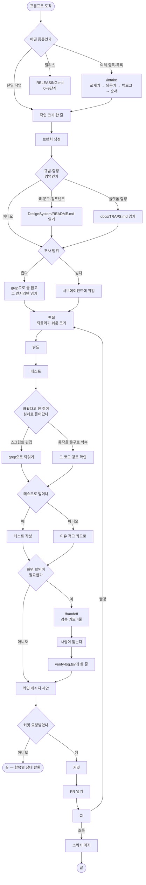
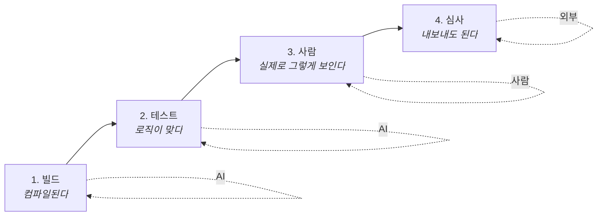

# 워크플로우

프롬프트 하나가 들어왔을 때 무엇이 어떤 순서로 도는지. **지금 실제로 도는 것**을
그린 것이고, 앞으로 이 순서가 바뀔 때마다 여기를 같이 고친다.

각 단계에 근거 문서를 붙여뒀다. 근거가 없는 칸이 있으면 그건 관행이지 규칙이
아니라는 뜻이다 — 그런 칸은 아래 "근거가 없는 칸"에 따로 모아뒀다.

## 전체 그림

## 단계별 근거

| # | 단계 | 근거 | 없으면 |
|---|---|---|---|
| 1 | 목록이면 `/intake` | `CLAUDE.md` R5, `.claude/skills/intake/SKILL.md` | 조용히 일부만 처리되고 다음 프롬프트가 "아직 안 됐는데"가 된다 |
| 2 | 작업 크기 한 줄 | `CLAUDE.md` R8 | 사용자가 모델을 내릴 판단 재료가 없다 |
| 3 | 브랜치 생성 | `CONTRIBUTING.md` 브랜치 전략 | `main`이 더러워진다. 예외 없음 |
| 4 | 규범·함정 읽기 | `CLAUDE.md` R6, `DesignSystem/README.md`, `docs/TRAPS.md` | 되돌린 시도를 다시 제안한다 |
| 5 | 읽는 범위 좁히기 / 넓으면 위임 | `CLAUDE.md` R10 · R9 | 컨텍스트가 부풀고 그 뒤 모든 턴이 비싸진다 |
| 6 | 편집 | `CLAUDE.md` 일하는 방식 | 되돌리기 어려운 덩어리가 된다 |
| 7 | 빌드 → 테스트 | `CLAUDE.md` R1 | 컴파일 에러를 사용자가 발견한다 |
| 8 | 반영 확인 | `CLAUDE.md` R1 (2026-08-19 추가) | 빌드는 통과했는데 의도한 변경이 안 들어가 있다 |
| 9 | 테스트 남기기 | `CLAUDE.md` R7 | 다음에 깨졌을 때 무엇이 깨졌는지 모른다 |
| 10 | 화면이면 `/handoff` | `CLAUDE.md` R2 · R3, `.claude/skills/handoff/SKILL.md` | "확인해줘"가 되고 확인이 대충 된다 |
| 11 | 검증 결과 기록 | `.claude/skills/handoff/SKILL.md` | R3의 통과율 데이터가 안 쌓인다 |
| 12 | 커밋은 요청받을 때만 | `CLAUDE.md` 일하는 방식 | 사용자가 안 본 것이 이력에 박힌다 |
| 13 | PR 템플릿 다섯 칸 | `.github/pull_request_template.md` | R1·R9의 기록 자리가 사라진다 |
| 14 | CI | `.github/workflows/ci.yml` | 맥·위젯이 깨진 채로 나간다 |

## 검증 사다리

워크플로우 안에서 "확인했다"고 말할 수 있는 근거는 네 칸으로 나뉜다. 아래로 갈수록
정확하고 비싸다.

1번과 2번만 AI가 할 수 있다. **그래서 AI가 "확인했다"고 쓸 수 있는 범위는 딱
거기까지다.** 3번은 검증 카드로 넘기고, 4번은 릴리스에서 만난다.

실제 버그는 대부분 3번과 4번에서 나왔다. v1.0.0 빌드 3은 WeatherKit 표기 누락으로
심사에서 반려됐고, v1.3.0의 KVS entitlement 문제는 사용자가 붙여준 실기기 로그에서
나왔다.

## 근거가 없는 칸

조사해보니 규칙은 있는데 그 규칙을 받아주는 자리가 없는 것들이 있다. 관행으로만
도는 부분이다.

| 규칙 | 없는 것 |
|---|---|
| R4 성능은 숫자로 | 절차·템플릿 칸이 전혀 없다. 지표(M4)는 사용자 발화만 세서 규칙이 금지한 것과 다른 것을 본다 |
| R10 읽는 범위 | 절차도 강제 장치도 없다. 지표(M15)는 `Read` 도구만 봐서 Bash로 읽으면 안 잡힌다 |
| R8 작업 크기 한 줄 | 말하고 끝이다. 어디에도 안 남아서 나중에 검증할 수 없다 |
| R6 "지킨 것도 한 줄 적는다" | PR 템플릿에 받는 칸이 없다 |
| R1 "반영 확인" | PR 템플릿의 `확인한 것`이 유일한 자리이고, 이것만 담당하는 지표가 없다 |
| R3 "검증 통과율" | 담당 지표인데 추출 스크립트에도 원장 열에도 없다. 손으로 쓰는 TSV 7행이 전부 |

## 이 문서를 언제 고치나

워크플로우가 바뀔 때마다. 구체적으로는 이런 때다.

- 규칙이 늘거나 줄었을 때 (`CLAUDE.md`)
- 스킬이 생기거나 절차가 바뀌었을 때 (`.claude/skills/`)
- CI 단계가 바뀌었을 때 (`.github/workflows/ci.yml`)
- 서브에이전트 구성이 바뀌었을 때 (`.claude/agents/`)

보고서를 쓸 때 이 문서가 최신인지 같이 확인한다.
