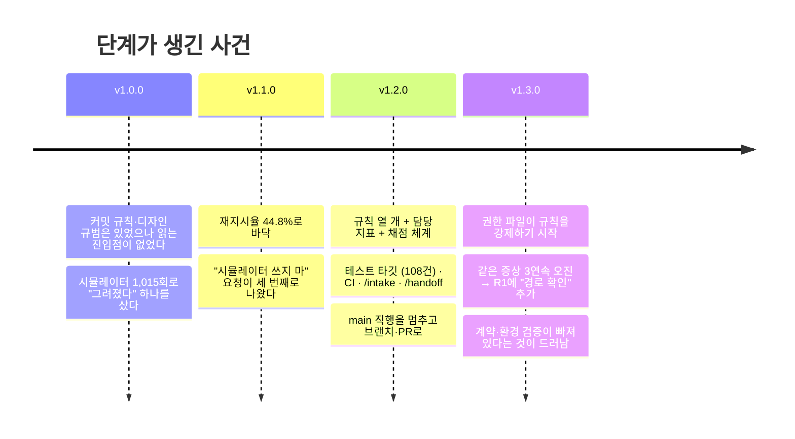
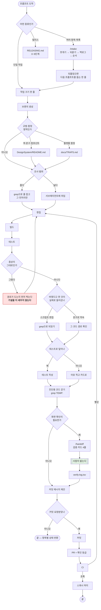
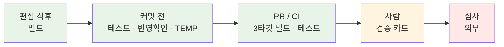

# 워크플로우

프롬프트 하나가 들어와서 코드가 `main`에 들어가기까지 무엇이 어떤 순서로 도는가.
그리고 **왜 그 순서인가.**

이 문서는 절차서가 아니라 **기록**이다. 각 단계는 누가 정해준 게 아니라 무언가
실패해서 생겼고, 그 사건과 숫자를 같이 적어둔다. 근거를 지우면 다음 사람이(다음
세션의 AI가) "이 단계 왜 있지?" 하고 걷어낸다.

---

## 1. 이 워크플로우는 어디서 왔나

### 숫자로 본 네 버전

| | v1.0.0 | v1.1.0 | v1.2.0 | v1.3.0 |
|---|---:|---:|---:|---:|
| 프롬프트 | 180 | 29 | 35 | 31 |
| 재지시율 (M1) | 31.1% | **44.8%** | 17.1% | **12.9%** |
| 빌드 실패율 (M3) | 12.0% | 20.6% | 15.9% | **4.8%** |
| 시뮬레이터 조작 (M11) | **1,015** | 716 | 26 | 18 |
| 스크린샷 | 391 | 229 | 10 | 5 |
| 회귀 테스트 (M10) | 0 | 0 | 108 | **112** |
| **프롬프트당 토큰 (M12)** | 17.1M | **31.1M** | 15.0M | **6.7M** |

읽는 법은 이렇다.

**v1.1.0이 바닥이다.** 재지시율 44.8%, 프롬프트당 토큰 31.1M. 규칙이 없던 게 아니라
(커밋 규칙과 디자인 규범은 첫날부터 있었다) **그걸 읽게 만드는 진입점이 없었다.**
그리고 스크린샷 229장이 컨텍스트를 계속 부풀렸다.

**v1.2.0에서 규칙 열 개와 테스트 타깃이 생겼다.** 시뮬레이터가 716 → 26으로
떨어졌고 테스트가 0 → 108이 됐다. 토큰이 절반이 됐다.

**v1.3.0에서 또 절반이 됐다.** 이번엔 규칙이 아니라 **일하는 방식**이 바뀐 결과였다 —
읽기와 편집을 한 명령에 묶으면서 턴이 1,259 → 563으로 줄었다.

### 워크플로우가 자란 순서

---

## 2. 전체 그림

빨간 칸은 v1.3.0에서 새로 생긴 것이다. 왜 생겼는지는 3-7에 있다.

---

## 3. 단계마다 — 무엇을, 왜, 무슨 근거로

### 3-1. 목록이면 먼저 쪼갠다 (`/intake`)

**규칙** R5 · **담당 지표** M2 배치 유발 배수 · **성적** 2.9 → **1.67**

프롬프트의 1/4이 4~7개짜리 목록이다. 그리고 v1.0.0 데이터에서 **배치 프롬프트 다음에
재지시가 올 확률이 단일 프롬프트 다음보다 1.27배 높았다.**

목록이 문제가 아니라 한 덩어리로 받아 한 덩어리로 답하는 게 문제였다. 조용히 일부만
처리되고 다음 프롬프트가 "아직 안 됐는데"가 된다. **2026-08-01에 받은 14개 목록 중
절반은 그 뒤 다시 언급되지 않았다.**

그래서 받은 즉시 항목별로 쪼개 먼저 보여주고, 두 갈래로 읽히는 것은 묻고, 전부
백로그에 적고, 끝나면 **받은 항목 전부**에 상태를 붙인다.

**그리고 되물었으면 한 줄을 더 남긴다** — 어떤 정보가 있었으면 안 물어도 됐는지.

> (참고) `이 화면`이 캘린더 하루치인지 오늘 할 일 탭인지 갈렸습니다.
> 다음엔 탭 이름을 같이 주시면 바로 갑니다.

이건 교정이 아니라 **다음 요청을 한 번에 끝내기 위한 것**이다. 되묻는 것 자체는
싸지만(잘못 만든 코드를 되돌리는 것보다 훨씬 싸다) 같은 종류의 모호함이 매번
반복되면 그 왕복이 쌓인다.

**v1.3.0에서 이 세 번째 몫이 한 번도 실행되지 않았다.** 다섯 번 되물었고 다섯 번 다
방향이 갈렸는데(특히 "MAC 지원"은 세 번 갈렸다) 그 줄은 0번이었다. 규칙에는
"같은 종류가 반복될 때만"이라는 단서가 있었고, **판단이 필요한 규칙은 판단하기 전에
잊힌다.**

그래서 2026-08-22에 이렇게 바꿨다 — **검토는 매번, 남기는 것은 판단.** 되물어 답을
받은 직후에 "남길 것이 있나"를 매번 보고, 없으면 안 남긴다. 두 번째로 같은 종류가
갈리면 그때는 반드시 남긴다.

**지표는 만들지 않았다.** 셀 수는 있지만(되물은 횟수 대비 남긴 횟수) 지표를 늘리는
것도 비용이라, 한 버전 지켜보고 그때 정한다.

### 3-2. 작업 크기를 한 줄 말한다

**규칙** R8 · **담당 지표** M13 상위 모델 비중 · **성적** 100% (3버전 연속, 미확인)

AI는 자기 모델을 못 바꾼다. 바꾸는 건 사람이고, 사람이 판단하려면 재료가 필요하다 —
파일 몇 개인지, 되돌리기 쉬운지, 조사가 필요한지.

**이 단계는 지금 근거가 약하다.** M13이 세 버전 연속 100%라 비교 대상이 없고, 말한
내용이 어디에도 안 남아서 나중에 검증할 수 없다.

### 3-3. 브랜치부터 만든다

**근거** `CONTRIBUTING.md` · **성적** v1.3.0에 PR 5개, `main` 직행 0

2026-08-18까지 `CONTRIBUTING.md`는 PR 절차를 적어놓고 실제로는 `main`에 직행하고
있었다. 지켜지지 않는 문장이 문서에 남아 있으면 **나머지 문장까지 신뢰를 잃는다.**
그래서 실제 기준을 다시 정하고, "문서 한 줄 고치는 것도 브랜치를 판다"로 예외를
없앴다.

### 3-4. 규범과 함정을 먼저 읽는다

**규칙** R6 · **담당 지표** M7 되돌림 사이클, M8 규범 드리프트 · **성적** 0 · 0 (2버전 연속)

`DesignSystem/README.md`는 스타일 가이드가 아니라 **되돌린 시도의 기록**이다. 한 번
해보고 아니었던 것을 다시 제안하지 않으려고 있다. `docs/TRAPS.md`도 같은 성격이다.

이 단계는 효과가 확인된 편이다. 다만 **M8이 0이어도 규범을 어길 수 있다** — M8은
규범 문서가 없는 심볼을 가리키는지만 보고 코드가 규범을 어기는지는 안 본다. v1.2.0에
실제로 두 번 어겼고 사람이 먼저 잡았다.

### 3-5. 읽는 범위를 좁힌다 / 넓으면 위임한다

**규칙** R10 · R9 · **담당 지표** M15 · M14

`Read`에 범위를 안 주면 파일 전체가 컨텍스트에 들어오고, **그 뒤 모든 턴이 그걸 다시
읽는다.** v1.0.0에서 전체 읽기가 67.7%였다.

넓은 조사는 서브에이전트에 맡긴다. v1.3.0 마지막에 처음 해봤고 실측이 나왔다 —
넷이 54만 토큰을 쓰고 요약만 돌려줬다. 직접 읽었으면 그 54만이 본 컨텍스트에 쌓여
남은 턴마다 다시 읽혔을 것이다.

**M15는 지금 측정 불능이다.** `Read` 도구만 세는데 읽기가 Bash의 `sed -n`으로
옮겨갔다. 규칙은 어느 때보다 잘 지켜지는데 지표는 100%가 나온다.

### 3-6. 빌드하고 테스트한다

**규칙** R1 · **담당 지표** M3 빌드 실패율 · **성적** 15.9% → **4.8%**

편집 후 빌드는 가장 싼 검증이다. 컴파일 에러를 사용자가 발견하는 일이 없어야 한다.
테스트 타깃이 생긴 뒤로는 테스트까지 포함한다.

**빌드 통과는 "컴파일된다"는 뜻이지 "내가 의도한 변경이 들어갔다"는 뜻이 아니다.**
v1.2.0에서 두 번 걸렸다 — 편집 스크립트가 앞쪽 파일에서 실패해 뒤쪽이 통째로 안
돌았는데 빌드는 통과했고, 위젯이 읽는 코드가 한 줄도 없는데 "위젯도 같이 바뀌어요"를
화면 문구로 적었다. 둘 다 사람이 잡았다. 그래서 **반영 확인**이 별도 단계가 됐다.

### 3-7. 증상이 그대로면 경로부터 찍는다 ← v1.3.0 신설

**규칙** R1 확장 · **담당 지표** M17 같은 증상 재시도 (신설, 미구현)

이 단계는 사고에서 나왔다. v1.3.0에서 "스와이프 삭제가 안 된다"를 **세 번 연속
헛짚었다.**

| 시도 | 무엇을 고쳤나 | 결과 |
|---|---|---|
| 1 | `swipeActions` 명시 | 증상 그대로 |
| 2 | `editMode`를 진짜 바인딩으로 | 증상 그대로 |
| 3 | List의 컨테이너 제스처 제거 | 증상 그대로 |

세 번 다 증상이 한 글자도 안 바뀌었는데 매번 다음 가설로 넘어갔다. 원인은 코드가
아니었다 — **그때 화면에 떠 있던 건 시간표 모드였고, 스와이프 삭제는 목록의
기능이다.** 고치고 있던 코드가 실행되지 않는 코드였다.

답을 준 것은 로그였다. 사용자가 "시뮬레이터 쓰지 말고 로그를 심어라"라고 했고, 심은
탐침이 **한 줄도 안 찍혔다.** 안 찍혔다는 사실 자체가 답이었다.

그래서 규칙이 됐다. **증상이 안 바뀌는 것은 "아직 못 찾았다"가 아니라 "그 코드가 안
돈다"는 신호다.** 세 번째 시도 전에는 반드시 경로가 도는지 찍는다.

### 3-8. 테스트를 남긴다

**규칙** R7 · **담당 지표** M10 · **성적** 108 → 112

R2로 시뮬레이터를 닫았으므로 테스트가 AI가 쓸 수 있는 유일한 검증이다. 빌드는
컴파일만 보고, 사람은 정확하지만 비싸다.

**테스트가 못 닿으면 코드를 옮긴다.** 시각 파싱은 `QuickAddView` 안의
`private static`이라 한 줄도 못 덮었는데, `TimeExpressionParser`로 꺼내니 21건이
붙었다. 화면 구조체 안에 순수 로직을 두면 그건 테스트가 없는 게 아니라 **테스트를
쓸 수 없는 것**이다.

**지금 이 단계에는 구멍이 있다.** v1.3.0에서 테스트로 못 덮는 것이 세 번 나왔다 —
제스처, 조건부 컴파일, entitlement. 5절에서 따로 다룬다.

### 3-9. 진단용 코드를 걷는다 ← v1.3.0 신설

**규칙** R11 · **담당 지표** M16 임시 코드 잔존

원인을 좁히려고 넣은 로그·탐침은 진단이 끝나면 쓰레기다. v1.3.0에서 탐침 파일 하나와
추적 로그 두 줄이 커밋될 뻔했고, **사용자가 "불필요한 코드는 제거하고"라고 말한
뒤에야** 걷었다.

PR 템플릿에 "불필요한 로그/주석 제거" 체크박스가 이미 있었는데 작동하지 않았다.
**스스로 체크하는 것은 강제 장치가 아니다.** 그래서 `// TEMP:` 표식으로 바꿨다 —
`grep` 한 번에 걸린다.

### 3-10. 화면 확인은 카드로 넘긴다 (`/handoff`)

**규칙** R2 · R3 · **담당 지표** M11 · 검증 통과율 · **성적** 1,015 → 26 → 18

v1.0.0에서 스크린샷 391장·시뮬레이터 조작 1,015회를 썼다. 그렇게 사서 얻은 것은
"그려졌다"는 약한 판정 하나뿐이었고, **실제 버그는 대부분 사람이 만져볼 때 나왔다.**
비싼 자리에서 약한 판정을 사는 거래였다.

그리고 "시뮬레이터 쓰지 마"라는 요청은 **세 번** 나왔다(2026-07-31, 08-05, 08-18).
앞의 두 번은 문서로 안 남겨서 다음 세션에 잊혔다. 세 번째에 규칙이 됐고, v1.2.0
보고서에서 **권한 파일의 `deny`**로 못 박았다.

카드는 네 줄이다 — 어디서 / 무엇을 / 무엇이 보이면 통과 / 무엇이 보이면 실패.
"확인해줘"만 보내지 않는다. 그건 무엇을 확인할지 설계하는 일을 사람에게 떠넘기는
것이다.

### 3-11. 커밋은 요청받을 때만, PR에는 등급을 붙인다

커밋 메시지는 매번 제안하되 찍지 않는다. PR 본문에는 다섯 칸이 있고, 그중 둘은
규칙이 남기는 자리다 — `확인한 것`(R1), `위임했으면 쌌을 곳`(R9).

**2026-08-22부터 확인 등급이 추가된다.** 🔴/🟡/🟢로 파일마다 표시해서 사람이 🔴만
읽어도 되게 한다. 기준은 [`review-criteria.md`](review-criteria.md)에 있다.

### 3-12. CI

**근거** `.github/workflows/ci.yml`

위젯 빌드 → 앱 빌드 + 테스트 → **Mac Catalyst 빌드**. 앱만 빌드하고 넘어가서
익스텐션이 깨진 채로 나간 적이 있어서 위젯을 따로 빌드하고, iOS가 통과해도 맥은
깨질 수 있어서 Catalyst를 따로 빌드한다(v1.3.0에 추가).

**CI는 마지막 그물이지 편집 후 확인을 대신하지 않는다.**

---

## 4. 워크플로우 어디에서 무엇이 검증되나

검증의 종류와 수단은 [`verification.md`](verification.md)에 자세히 있다. 여기서는
**워크플로우의 어느 칸에서 잡히는가**만 본다.

| 검증 종류 | 어디서 잡히나 | 지금 상태 |
|---|---|---|
| **기능** (입력 → 출력) | 커밋 전 (테스트 112건) | ✅ 잘 돈다 |
| **기능** (화면 흐름·제스처) | 사람 | ❌ UI 테스트가 없다 |
| **계약** (entitlements·plist·버전) | — | ⚠️ `artifact_check.sh`를 CI에 붙이는 중 |
| **환경** (iOS/맥, 시뮬/실기기) | PR/CI (빌드만) · 사람 (실행) | ⚠️ 절반 |
| **품질** (셀 수 있는 것) | — | ⚠️ `quality_baseline.py`를 CI에 붙이는 중 |
| **품질** (판단) | 규범 문서 + 사람 | ✅ M8 두 버전 연속 0 |

**아래로 갈수록 늦고 비싸다.** 늦게 잡힐수록 사람의 왕복으로 지불된다.

---

## 5. 이 워크플로우가 못 잡은 것

정직하게 적는다. v1.3.0에서 잡힌 버그 넷은 **전부 "사람" 칸에서 잡혔다.**

| 버그 | 잡힌 곳 | 원래 잡혔어야 할 곳 | 왜 못 잡았나 |
|---|---|---|---|
| 스와이프 삭제 오진 (5회 왕복) | 사람 | 편집 직후 | 경로 확인 단계가 없었다 → **3-7로 추가됨** |
| KVS entitlement 누락 | 사람 (실기기 로그) | 커밋 전 | 계약 검증 칸이 없었다 → **`artifact_check.sh`** |
| 그 수정이 시뮬레이터 실행을 막음 | 사람 (스크린샷 찍다가) | PR/CI | 환경 검증 칸이 없었다 → **미해결** |
| 맥에서 날씨가 안 불림 | 사람 | PR/CI | 위와 같음 → **미해결** |

**넷 다 두세 칸 늦게 잡혔다.** 그중 둘은 이번에 메웠고, 둘(환경 검증)은 아직이다 —
CI에서 앱을 실제로 설치·실행하는 스모크가 필요하다.

---

## 6. 아직 근거가 없는 칸

규칙은 있는데 그것을 받아주는 자리가 없는 것들이다. **관행으로만 돈다.**

| 규칙 | 없는 것 | 결과 |
|---|---|---|
| R4 성능은 숫자로 | 절차도 템플릿 칸도 없다. 지표(M4)는 **사용자 발화**만 세는데 규칙이 금지한 건 AI가 감각어를 쓰는 것 | 규칙과 지표가 서로 다른 것을 본다 |
| R10 읽는 범위 | 절차도 강제 장치도 없다. 지표는 `Read`만 본다 | Bash로 읽으면 전량 우회 |
| R8 작업 크기 | 말하고 끝. 어디에도 안 남는다 | 나중에 검증 불가 |
| R6 "지킨 것도 한 줄" | PR 템플릿에 받는 칸이 없다 | 기록이 안 쌓인다 |
| R1 "반영 확인" | 이것만 담당하는 지표가 없다 | M3(컴파일)·M1(사용자 반응)로 간접 추정 |
| R3 "검증 통과율" | **추출 스크립트에도 원장 열에도 없다** | 손으로 쓰는 TSV 7행이 전부 |
| R5 "다음 프롬프트 돕기" | 지표가 없다 (**의도적으로 안 만들었다**) | v1.4.0에 실행됐는지 정성적으로 본다 |

그리고 규칙과 권한 파일이 어긋난 자리가 셋 있다. R2는 시뮬레이터를 금지하는데
`allow`에 `xcrun simctl`이 열려 있고, R1이 매번 요구하는 `xcodebuild test`는 어느
`allow`에도 없어 매번 승인을 탄다. **AI가 자기 권한 파일을 못 고치므로 사람이 해야
한다** (`docs/BACKLOG.md`).

---

## 7. 이 문서를 언제 고치나

워크플로우가 바뀔 때마다. **그리고 바꾼 이유와 그때의 숫자를 같이 적는다.**

- 규칙이 늘거나 줄었을 때 (`CLAUDE.md`)
- 절차 스킬이 생기거나 바뀌었을 때 (`.claude/skills/`)
- CI 단계가 바뀌었을 때
- 서브에이전트 구성이 바뀌었을 때 (`.claude/agents/`)
- **사고가 났을 때** — 5절에 한 줄 추가한다. 그 표가 다음 단계를 만든다

버전 보고서를 쓸 때 이 문서가 최신인지 같이 확인한다.

## 같이 보는 문서

- [`verification.md`](verification.md) — 검증 넷으로 나누기, 수단과 시점
- [`review-criteria.md`](review-criteria.md) — 사람이 봐야 하는 코드
- [`harness/rules.md`](harness/rules.md) — 규칙별 채점 원장
- [`harness/reports/`](harness/reports/) — 버전별 보고서
- [`architecture/CONVENTIONS.md`](architecture/CONVENTIONS.md) — 코드를 어디 두나
